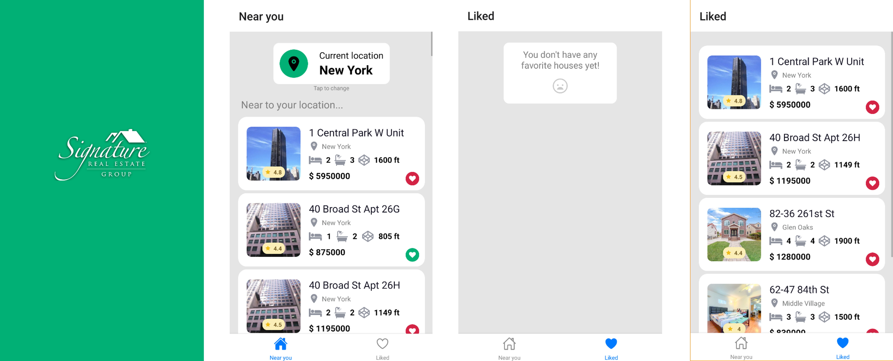

# Signature Real State App

## Contents Table

- [Description](#Description)
- [Use](#Use)
  - [Install dependencies](#Install-dependencies)
  - [Run](#Run)
  - [Tests](#Tests)
- [Credits](#Credits)
- [Badges](#Badges)

## Description.
    Real State App composed by:
      -SplashScreen: Welcoming screen to show the name of the app.
      -Home Screen: Shows the offered properties depending on the location. Each property can be liked or unliked.
      -Liked Houses Screen: Shows the liked properties. The properties can also be unliked.
    
# Use

### Install dependencies

npm install

### Run

npm start

### Tests

npm test

## Credits

- [@Camilapinz18](https://github.com/Camilapinz18)
    
## Badges

